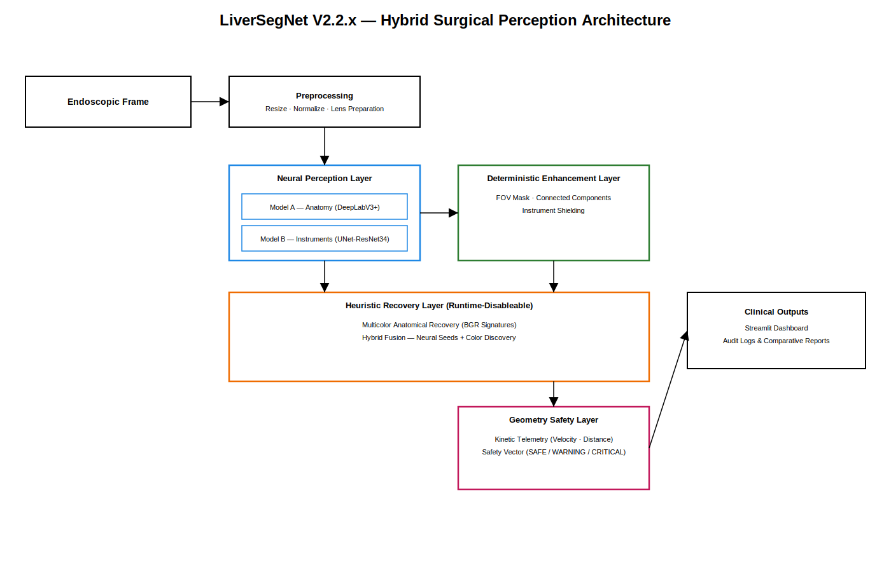
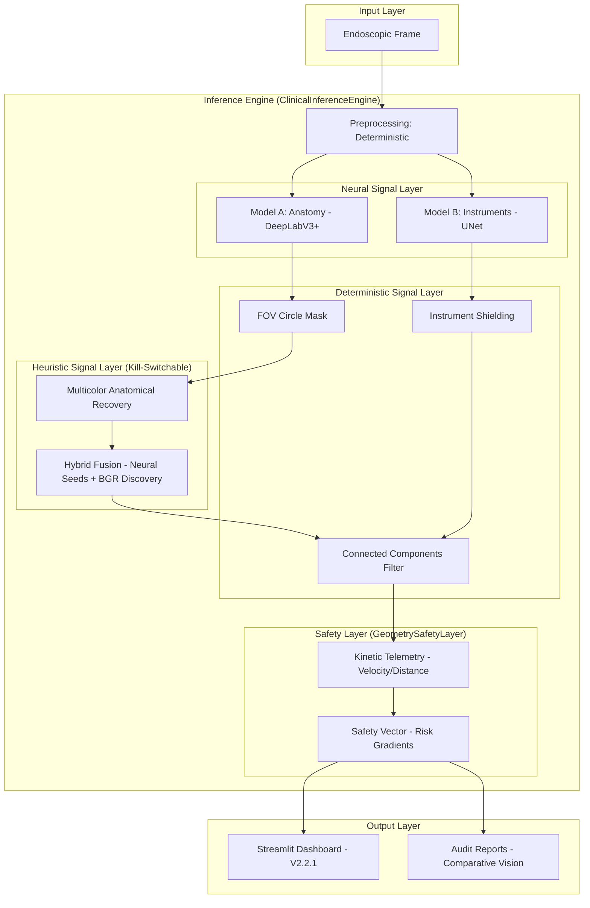

# LiverSegNet V2.2.1 Architecture

The system is designed as a **Hybrid Perception Pipeline**, combining neural deep learning, deterministic geometric guards, and heuristic color-based discovery.

## Signal Definitions

*   **NEURAL**: Deep learning posterior probabilities (DeepLabV3+ & UNet).
*   **DETERMINISTIC**: Hard geometric constraints (FOV masking, Morphology).
*   **HEURISTIC**: Physically-informed color recovery signatures (BGR MAR).
