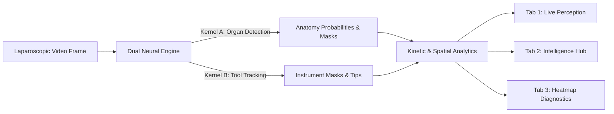

# LiverSegNet Surgical Analytics & Dashboard Guide
*A Presentation & Clinical Reference Manual for Real-Time Laparoscopic Navigation*

---

> [!IMPORTANT]
> **Core Objective**: This manual provides a clean, textbook-style explanation of every graph, visual metric, and heatmap generated by the **LiverSegNet V3.0.0-HYBRID** dashboard (`ui/dashboard.py`).

---

## 🗺️ System Data Flow

---

## 📊 Summary of Dashboard Analytics

| Dashboard Section       | Visual Chart Type                        | What It Measures                         | Target Normal Range | Critical Risk Trigger            |
|:------------------------|:-----------------------------------------|:-----------------------------------------|:-------------------:|:---------------------------------|
| **Boundary Precision**  | Smooth Trend Line + Moving Average       | Sharpness of organ edges                 |    `0.85 – 1.00`    | `< 0.10` (Blurry / Occluded)     |
| **Tissue Displacement** | Filled Area Chart + Multi-Threshold Line | Distance from tool tip to liver          |     `> 6.06 mm`     | `≤ 2.46 mm` (Compression / Tear) |
| **Tool Jitter (L2)**    | Scatter Plot + Trend Line                | Instrument speed & stability             |  `0.0 – 15.0 px/f`  | `> 50.0 px/f` (Sudden jerk/flick)|
| **Model Consensus**     | Color-Coded Radial Gauge & Bar Chart     | Agreement between AI models              |    `85% – 100%`     | `< 60%` (Overlap conflict)       |
| **Shannon Uncertainty** | Spatial Heatmap Overlay                  | AI hesitation & doubt zones              | Low Doubt (Purple)  | High Hesitation (Bright Yellow)  |
| **Confidence Histogram**| Dual-Color Frequency Bars                | Pixel-by-pixel certainty                 | 0.0 & 1.0 Peaks     | Broad 0.3 – 0.7 Spread           |
| **Per-Class Footprint** | 5-Axis Radar Polygon                     | Organ detection coverage                 | Expanded Polygon    | Shrunken Center                  |

---

## 📘 Comprehensive Graph Breakdown

### 1️⃣ Anatomical Boundary Precision

> [!NOTE]
> **Plain English Meaning**: Measures how crisp and clear the edge of the liver appears to the AI.

* **Visual Style**: Solid Neon Green line with a 3-frame moving average (SMA) and a yellow threshold line at 0.85.
* **Why It Matters**: Surgical smoke, blood pooling, or lens fog blur tissue edges. This graph alerts surgeons when visual clarity drops.
* **How to Read It**:
  * **High Values (0.85 – 1.0)**: Crisp organ contour, optimal visual field.
  * **Low Values (< 0.10)**: Blurry boundary; possible smoke or obstruction.

---

### 2️⃣ Tool-Induced Tissue Displacement

> [!NOTE]
> **Plain English Meaning**: Measures physical distance between surgical instruments and organ tissue in millimeters.

* **Visual Style**: Soft Cyan filled area chart with Warning (6.06 mm) and Critical (2.46 mm) threshold lines.
* **Why It Matters**: Prevents accidental organ punctures or tearing during delicate laparoscopic maneuvers.
* **How to Read It**:
  * **Safe Zone (> 6.06 mm)**: Tools are at a comfortable distance from organ tissue.
  * **Warning Zone (2.46 – 6.06 mm)**: Tool is approaching organ tissue; caution advised.
  * **Critical Zone (< 2.46 mm)**: Active contact or dangerous proximity detected.

---

### 3️⃣ Instrument Tip Localization & Jitter (L2)

> [!NOTE]
> **Plain English Meaning**: Measures how fast and smoothly instrument tips are moving frame-by-frame.

* **Visual Style**: Pink scatter plot with connected line segments and 3-frame SMA trendline.
* **Why It Matters**: Detects sudden jerks, tremor, or tracking loss in tool detection.
* **How to Read It**:
  * **Low Jitter (0 – 15 px/f)**: Smooth, controlled surgical movement.
  * **Spikes (> 50 px/f)**: Rapid tool insertion, movement, or tracking flicker.

---

### 4️⃣ Model Consensus Score

> [!NOTE]
> **Plain English Meaning**: Checks if the Organ Model and Tool Model agree on spatial separation.

* **Visual Style**: 
  1. **Radial Speedometer Gauge**: Real-time score for the active frame.
  2. **Color Bar Chart**: Historic sequence scores (Green >= 85%, Yellow 60–85%, Red < 60%).
* **Why It Matters**: Ensures the AI doesn't mistakenly classify a metallic grasper as liver tissue or vice versa.
* **How to Read It**:
  * **100%**: Perfect logical separation (No overlap).
  * **< 60%**: Overlap detected between organ mask and tool mask.

---

### 5️⃣ Heatmaps & Shannon Uncertainty Maps

> [!NOTE]
> **Plain English Meaning**: Shows visual "warmth" maps of AI confidence and highlights zones of AI hesitation.

* **Visual Overlays**:
  * **Organ Confidence Heatmap**: Inferno colormap (Red/Yellow = 90–100% confidence).
  * **Shannon Entropy Uncertainty Map**: Highlighting doubt zones where the AI is uncertain.
* **How to Read It**:
  * **Dark / Cold Color**: High certainty; clear prediction.
  * **Bright Yellow / White**: High entropy/doubt; boundary transition zone.

---

### 6️⃣ Softmax Confidence Distribution & Per-Class Radar

> [!NOTE]
> **Plain English Meaning**: Shows the statistical distribution of confidence values across all image pixels.

* **Histogram**: Plots pixel counts across confidence values (0.0 to 1.0) for Liver (Green) and Gallbladder (Cyan). Healthy models display sharp peaks at 0.0 (background) and 1.0 (target organ).
* **Radar Polygon**: Displays maximum confidence across all 5 classes on a 5-axis radial star diagram.

---

## 🔍 Peak Confidence vs. Spatial Reliability

> [!TIP]
> **Understanding the Difference**:

| Metric                     | Calculation Method                             | What It Tells You                                                |
|:---------------------------|:-----------------------------------------------|:-----------------------------------------------------------------|
| **Peak Liver Confidence**  | Maximum single pixel score across organ channel | Confirms whether liver tissue is **present anywhere** in frame.  |
| **Spatial Reliability**    | Average score over localized organ region      | Measures how **solid and uniform** the organ segmentation is.    |

---

## 🧪 Benchmark Test Cohort Summary

The table below demonstrates telemetry values collected across 4 test sequence frames in `Downloads/Images Folder`:

| Image File                     | Peak Liver Conf | Spatial Reliability | Tool Tips | Boundary Precision | Displacement       | Safety Status   |
|:-------------------------------|:---------------:|:-------------------:|:---------:|:------------------:|:------------------:|:---------------:|
| `Liver bladder + 2 tools.png`  |    `0.9931`     |      `0.6006`       |     2     |      `0.1337`      | 0.65 mm (5.39 px)  | 🔴 **CRITICAL** |
| `improper lighting.png`        |    `0.9719`     |      `0.5892`       |     2     |      `0.1564`      | 1.02 mm (8.50 px)  | 🔴 **CRITICAL** |
| `3 tools.png`                  |    `0.9719`     |      `0.5892`       |     3     |      `0.1107`      | 4.03 mm (33.57 px) | 🔴 **CRITICAL** |
| `seg8k_video12_015844.png`     |    `0.9992`     |      `0.5960`       |     2     |      `0.1444`      | 6.54 mm (54.48 px) | 🔴 **CRITICAL** |
